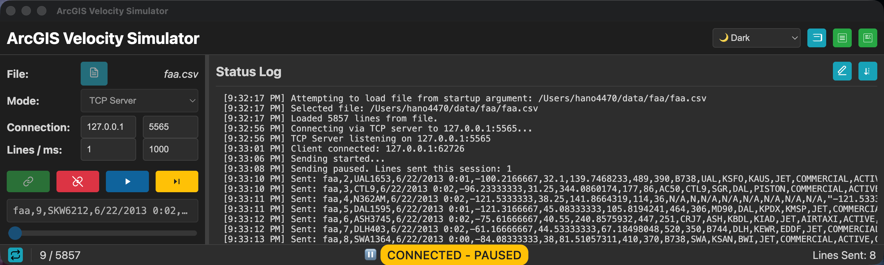

# ArcGIS Velocity Simulator


<p style="text-align: center;">
  
</p>

<p style="text-align: center;"><em>Main ArcGIS Velocity Simulator application interface.</em></p>

A cross-platform desktop application for simulating data streams over TCP/UDP protocols. Load CSV files and send data at configurable intervals for testing and development purposes.

## Documentation

> 📖 **[docs/README.md](./docs/README.md)** — full index of all documentation in this folder

| Guide | Summary |
|-------|---------|
| [Architecture](./docs/ARCHITECTURE.md) | Process topology, components, IPC, data flow, and security model |
| [Build & Package](./docs/BUILD.md) | All build scripts, compression options, sequential/parallel builds, and output artifacts |
| [Command-Line Reference](./docs/COMMAND-LINE.md) | All CLI parameters, headless mode, help layouts, and usage examples |
| [Configuration](./docs/CONFIG.md) | Config file format, all settings, themes, fonts, and storage locations |
| [Debugging](./docs/DEBUGGING.md) | Debug commands, DevTools and VSCode setup, headless debugging, common issues |
| [Development Summary](./docs/DEVELOPMENT-SUMMARY.md) | Technical implementation details and development decisions |
| [Documentation Index](./docs/DOCUMENTATION.md) | Full doc index with audience classification and maintenance notes |
| [gRPC Transport](./docs/GRPC.md) | gRPC modes, serialization formats (Protobuf/Kryo/Text), and TLS |
| [HTTP Transport](./docs/HTTP.md) | HTTP/HTTPS modes, data formats (JSON/CSV/Esri JSON/GeoJSON/XML), and TLS |
| [WebSocket Transport](./docs/WEBSOCKET.md) | WebSocket (ws/wss) modes, formats, TLS, subscription messages, custom headers |
| [Headless Mode](./docs/HEADLESS.md) | No-UI simulation: parameters, config file workflow, output formats, done file |
| [Keyboard Shortcuts](./docs/KEYBOARD-SHORTCUTS.md) | All keyboard shortcuts and context menu reference |
| [Offline Speech](./docs/OFFLINE-SPEECH-README.md) | Offline speech recognition setup, commands, and troubleshooting |
| [Release Notes](./docs/RELEASE-NOTES.md) | User-facing features and changes by release |
| [Release Process](./docs/RELEASE.md) | `scripts/release.sh` release script, version tagging, and code signing for all platforms |
| [Speech Integration Summary](./docs/SPEECH-INTEGRATION-SUMMARY.md) | Architecture summary for the Web Audio API offline speech system |
| [Testing](./docs/TESTING.md) | Test commands, suite descriptions, and manual smoke tests |
| [Theme Refactoring](./docs/THEME-REFACTORING.md) | Theme system refactoring: per-file CSS and dynamic loader |
| [TLS / SSL Security](./docs/TLS.md) | TLS concepts, certificate formats, OS trust stores, mTLS, auto self-signed certs, and TLS Trust Badge |
| [Velocity Login](./docs/VELOCITY-LOGIN.md) | ArcGIS Velocity sign-in, feed picker, token-based authentication, and auto-configuration |
| [Why Electron](./docs/WHY-ELECTRON.md) | Framework rationale and packaging overview |

### In-App Help

- **`F1`** — Help dialog
- **`F3`** — Command Line Interface dialog (searchable CLI reference, copy/export)
- **Right-click** — Context menu (themes, fonts, opacity, tools)

### Config Templates

- [`launch-config.sample.json`](./docs/launch-config.sample.json) — generic headless template
- [`launch-config.server.sample.json`](./docs/launch-config.server.sample.json) — server-mode template
- [`launch-config.client.sample.json`](./docs/launch-config.client.sample.json) — client-mode template

## Overview

The ArcGIS Velocity Simulator is designed for developers and testers who need to simulate real-time data streams. It provides a comprehensive solution for:

- **Data Streaming**: Send CSV data over TCP/UDP in server or client mode
- **Cross-Platform Support**: Native apps for macOS, Windows, and Linux
- **Hands-Free Operation**: Gesture and voice control for accessibility
- **Rich Customization**: 15 themes, 17 fonts, dual view modes, and persistent configuration
- **Developer-Friendly**: Comprehensive debugging tools and testing infrastructure

The application follows a modern Electron architecture with secure IPC communication, robust error handling, and extensive documentation.

## Key Features

- **Data Streaming**: Send CSV data over TCP/UDP in server or client mode
- **Cross-Platform**: Native apps for macOS, Windows, and Linux
- **Headless Automation**: Run batch streaming sessions with no UI using command-line parameters
- **Interactive Help & Command-Line Reference**: Open `F1` for the general Help dialog and `F3` for the dedicated Command Line Interface dialog with searchable, sortable parameters, quick chips, active-filter pills, and visible-row copy/export in TSV, CSV, Markdown, or JSON
- **Gesture & Voice Control**: Hands-free operation with webcam and microphone
- **15 Themes**: 🔵 Blue, 🟡 Color Blind, 🌙 Dark, 🌫️ Dark Gray, 🟢 Green, ⚫ High Contrast, ☀️ Light, ☁️ Light Gray, 🌌 Midnight, ☕ Mocha, 🌊 Ocean, 🌸 Rose, 🌺 Rose Dark, 🌅 Sunset, 💻 System
- **Dual View Modes**: Full interface or compact minimalist view
- **Configuration Management**: Persistent settings and state across sessions
- **Feature Support Controls**: Enable/disable camera and microphone features as needed
- **Status Log Sorting**: Toggle ascending/descending order for status messages with a single click
- **Granular Logging Controls**: Toggle hand-gesture and microphone command logging for concise or verbose status output

## Feature Support Controls

The application includes configurable support for camera and microphone features. These can be enabled or disabled through the application menus:

### Camera Support
- **Location**: Configuration menu → Camera Support
- **Controls**: Toggle Camera, Report Camera Gestures, Log Camera Gestures
- **Default**: Disabled (buttons hidden)
- **Safety**: Automatically turns off camera when support is disabled
- **Compact Mode**: Camera buttons are hidden in compact view

### Microphone Support
- **Location**: Configuration menu → Microphone Support
- **Controls**: Toggle Microphone (Web Speech API), Toggle Offline Speech Recognition (Web Audio API), Log Microphone Commands
- **Default**: Disabled (buttons hidden)
- **Safety**: Automatically turns off both microphone systems when support is disabled
- **Compact Mode**: Microphone buttons are hidden in compact view
- **Error Handling**: Network errors are logged once per session, microphone remains controllable

### Access Methods
- **Main Menu**: Configuration → Camera Support / Microphone Support
- **Context Menu**: Right-click → Camera Support / Microphone Support
- **Persistence**: Settings are saved to configuration file and restored on startup

## Hand Gesture Controls

Control the simulator hands-free using your webcam and TensorFlow.js for real-time hand gesture recognition.

### Setup
1. Click the **Cam** button in the header
2. Allow webcam access when prompted
3. Perform gestures in front of the camera

### Supported Gestures
| Gesture | Action | Description |
|:---|:---|:---|
| 👍 Thumbs Up | **Connect** | Establishes connection to TCP/UDP endpoint |
| 🤙 Pinky Up | **Disconnect** | Terminates active connection |
| 👊 Closed Fist | **Play / Resume** | Starts or resumes sending data |
| 🖐️ Open Palm | **Pause** | Pauses the data stream |
| ✌️ Victory Sign | **Step** | Sends next single line of data |

## Voice Controls

The application supports two voice control systems for hands-free operation:

### 1. Online Voice Recognition (Web Speech API)
Voice commands using the Web Speech API for internet-connected environments.

#### Setup
1. Click the **Mic** button in the header
2. Allow microphone access when prompted
3. Speak commands clearly

#### Status Messages
- **On**: "Microphone (Web Speech API) on. Supported commands: connect, disconnect, play, start, pause, stop, step, switch, toggle view"
- **Off**: "Microphone (Web Speech API) off."
- **Network Error**: "Web Speech API requires internet connection. Use the offline microphone button for local speech recognition." (logged once per session)

#### Supported Voice Commands
| Command | Action | Description |
| :--- | :--- | :--- |
| "connect" | **Connect** | Establishes connection to TCP/UDP endpoint |
| "disconnect" | **Disconnect** | Terminates active connection |
| "play", "start" | **Play** | Starts or resumes sending data |
| "pause", "stop" | **Pause** | Pauses the data stream |
| "step" | **Step** | Sends next single line of data |
| "switch", "toggle view" | **Switch Views** | Toggles between full and compact interface |

### 2. Offline Voice Recognition (Web Audio API)
Privacy-focused offline voice recognition using frequency analysis.

#### Setup
1. Click the **Offline Mic** button (checkmark icon) in the header
2. Enable "Log Microphone Commands" for detailed feedback
3. Allow microphone access when prompted
4. Speak commands clearly and distinctly

#### Status Messages
- **On**: "Microphone (Web Audio API) Offline Speech Recognition on. Supported commands: connect, disconnect, play, start, pause, stop, step, switch, toggle view"
- **Off**: "Microphone (Web Audio API) Offline Speech Recognition off."

For a complete feature overview, setup tips, and troubleshooting, see the offline guide: [OFFLINE-SPEECH-README.md](./docs/OFFLINE-SPEECH-README.md).
Also see the User Documentation entry: [Offline Speech usage and setup](./docs/DOCUMENTATION.md#user-documentation).

#### Features
- **100% Offline**: No internet connection required
- **Privacy-Focused**: All processing happens locally
- **Visual Feedback**: Real-time audio visualization
- **Frequency Analysis**: Pattern-based command recognition

#### Supported Commands
| Command | Action | Frequency Pattern |
| :--- | :--- | :--- |
| "connect" | **Connect** | Balanced low-mid frequencies |
| "disconnect" | **Disconnect** | Low frequency dominant |
| "play", "start" | **Play** | High frequency dominant |
| "pause", "stop" | **Pause** | Low frequency dominant |
| "step" | **Step** | High-mid frequency mix |
| "switch", "toggle view" | **Switch Views** | Mid frequency dominant |

## Quick Reference

### Keyboard Shortcuts
- `Ctrl+I` / `Cmd+I` - Open Preferences
- `Ctrl+Shift+C` / `Cmd+Shift+C` - Connect
- `Ctrl+D` / `Cmd+D` - Disconnect
- `Ctrl+T` / `Cmd+T` - Toggle View (Full/Compact)
- `F1` - Help, `F2` - About, `F3` - Command Line Interface

Inside the Command Line Interface dialog, you can also use `Ctrl+F` / `Cmd+F` (or `/`) to focus the command-line filter and `Escape` to close the dialog.

See [KEYBOARD-SHORTCUTS.md](./docs/KEYBOARD-SHORTCUTS.md) for complete list.

### Status Log Controls
- **Sort Order**: Use the sort button in the Status Log header to switch between **Ascending** and **Descending** order (default: Ascending). The icon changes to reflect the current order.
- **Show/Hide**: Use the status log toggle in the top header to show or hide the panel. Visibility is persisted across sessions.
- **Clear**: Use the trash icon to clear the log and reset counters.

### Context Menu (Right-click)
- Theme selection (🔵🟡🌙🌫️🟢⚫☀️☁️🌌☕🌊🌸🌺🌅💻 15 themes)
- Opacity control (50%–100% window transparency)
- Font size and family adjustment
- Configuration management
- Developer tools
- View mode switching

## Quick Start

### Prerequisites
- [Node.js](https://nodejs.org/) (v18 or newer)
- [npm](https://www.npmjs.com/) (comes with Node.js)

### Installation & Usage

```bash
npm install
```

**Running the app:**

| Command | Purpose |
|---------|---------|
| `npm start` | Launch in UI mode |
| `npm start -- filename=./example-data.csv` | Launch with a file preloaded |

**Command-line help:**

| Command | Output |
|---------|--------|
| `npm run help:cli` | Compact layout |
| `npm run help:cli:wide` | Wide ASCII table |
| `npm run help:cli:narrow` | Narrow ASCII table |
| `npm start -- help=true` | Compact (via launcher) |
| `npm start -- -h` | Short alias |
| `npm start -- --help` | Bare flag |
| `npm start -- help-table-wide=true` | Wide table (via launcher) |
| `npm start -- --help-table-wide` | Wide table (bare flag) |
| `npm start -- help-table-narrow=true` | Narrow table (via launcher) |
| `npm start -- --help-table-narrow` | Narrow table (bare flag) |

**Headless batch session:**

```bash
npm run start:headless -- filename=./example-data.csv protocol=tcp mode=client ip=127.0.0.1 port=5565 linesPerInterval=1 intervalMs=1000 autoConnect=true autoStart=true loop=false exitOnComplete=true stdout=true
```

### Headless Mode

When no parameters are provided, the app starts in the normal UI mode and preserves saved UI behavior from configuration, including the saved compact/full view.

The app also supports a true no-UI execution path with `runMode=headless` (or `runMode=silent`). In this mode the Electron process does not create the splash screen or the main window; instead, a backend simulation engine loads the file, establishes the network transport, streams records, and exits when complete if configured to do so.

Common parameters include:

- `filename=/path/to/file.csv`
- `protocol=tcp|udp`
- `mode=server|client`
- `ip=127.0.0.1`
- `port=5565`
- `linesPerInterval=1`
- `intervalMs=1000`
- `loop=true|false`
- `waitForClient=true|false`
- `startLine=1`
- `endLine=500`
- `maxLines=1000`
- `connectTimeoutMs=5000`
- `logLevel=error|warn|info|debug`
- `logFile=/path/to/run.log`
- `doneFile=/path/to/run.done.json`
- `onError=exit|continue|pause`

Only `filename` is required once headless mode has been selected; all other headless parameters are optional and have defaults.

For `ip`, the default is `127.0.0.1` for local-only testing. In server mode, use `ip=0.0.0.0` when the simulator should listen on all interfaces so other machines can connect.

Standard help (`npm run help:cli`, `npm start -- help=true`, `npm start -- h=true`, `npm start -- -h`, or `npm start -- --help`) uses the non-table layout.

Unknown CLI parameters — including bare positional arguments without `name=value` syntax — abort startup with a clear error message, display the help text, and exit the app without launching the UI or headless runner.

Headless-only parameters passed in UI mode (e.g. `port=6000`, `protocol=udp`) are **not** errors. A `CLI warning:` line is logged per parameter explaining why it has no effect, and the app continues to launch normally. The same applies in headless mode for parameters that don't apply to the current sub-configuration (e.g. `connectRetryIntervalMs` when `connectWaitForServer=false`).

By default the app prints a **startup explanation** to the console showing the resolved run mode, active parameters, and any warnings. Pass `explain=false` to suppress this output.

The same command-line metadata is also surfaced inside the dedicated in-app Command Line Interface dialog (`F3`) as a searchable reference with quick category chips, active-filter pills, sortable columns, and copy/export actions for visible rows in TSV, CSV, Markdown, or JSON format. The Command Line Interface dialog and markdown guides use the same six-column CLI schema: Name, Supported Values, Default, Required in Headless Mode, Example, and Purpose.

If you prefer an ASCII table, use either of these explicit help-layout parameters:

- `npm run help:cli:wide`, `help-table-wide=true`, or `--help-table-wide` for wider terminals
- `npm run help:cli:narrow`, `help-table-narrow=true`, or `--help-table-narrow` for tighter terminals

When multiple help layouts are requested together, the narrower table layout takes precedence over the wider table layout, and either table layout takes precedence over standard help.

For the complete parameter list, defaults, required/optional rules, and examples, see [COMMAND-LINE.md](./docs/COMMAND-LINE.md) and [HEADLESS.md](./docs/HEADLESS.md).
A ready-to-copy sample config file is also included at [docs/launch-config.sample.json](./docs/launch-config.sample.json).
Additional mode-specific examples are included at [docs/launch-config.server.sample.json](./docs/launch-config.server.sample.json) and [docs/launch-config.client.sample.json](./docs/launch-config.client.sample.json).

You can launch the included templates directly:

```bash
npm run start:headless -- config=./docs/launch-config.sample.json
npm run start:headless -- config=./docs/launch-config.server.sample.json
npm run start:headless -- config=./docs/launch-config.client.sample.json
```

You can also override individual values at launch time without editing the file:

```bash
npm run start:headless -- config=./docs/launch-config.client.sample.json ip=192.168.1.25 port=6000 runId=manual-override
```

### First Steps
1. **Load Data**: Click "Select File" to load a CSV file
2. **Configure Connection**: Set IP address, port, and connection type (TCP/UDP)
3. **Connect**: Click "Connect" or use gesture/voice control
4. **Start Streaming**: Click "Play" to begin sending data
5. **Monitor**: Watch the status bar for real-time feedback

### Hands-Free Control
- **Gesture Control**: Click the camera icon and perform hand gestures
- **Online Voice Control**: Click the microphone icon and speak commands (requires internet)
- **Offline Voice Control**: Click the offline microphone icon for privacy-focused voice control
- **Keyboard Shortcuts**: Use keyboard shortcuts for quick access (see [KEYBOARD-SHORTCUTS.md](./docs/KEYBOARD-SHORTCUTS.md))

### Customization
- **Themes**: Right-click to access 15 different themes
- **Fonts**: Choose from 17 font families for the status log
- **View Modes**: Toggle between full and compact interface
- **Configuration**: Persistent settings across sessions


### Configuration
Settings are automatically saved to platform-specific locations:
- **macOS**: `~/Library/Application Support/arcgis-velocity-simulator/config.json`
- **Windows**: `%APPDATA%\arcgis-velocity-simulator\config.json`
- **Linux**: `~/.config/arcgis-velocity-simulator/config.json`

#### Resetting Configuration
You can reset all settings to their defaults from the main menu (Configuration → Reset Configuration) or the context menu (**Reset Config**). The app will keep your current view mode (full or compact) after reset.
## Development

### Getting Started
1. Clone the repository.
2. Install dependencies: `npm install`
3. Start the application in development mode: `npm start`

### Debugging
For a comprehensive guide on debugging the main and renderer processes, see [DEBUGGING.md](./docs/DEBUGGING.md).

| Command | Purpose |
|---------|---------|
| `npm run debug-main` | Debug backend (port 9229) |
| `npm run debug-renderer` | Debug frontend (port 9222) |
| `npm run debug-both` | Debug both processes simultaneously |

### Testing
For a detailed guide on the testing infrastructure, see [TESTING.md](./docs/TESTING.md).

| Command | What it tests |
|---------|---------------|
| `npm test` | All test suites |
| `npm run test:config` | Configuration management |
| `npm run test:cli` | Command-line parsing and help |
| `npm run test:engine` | Headless simulation engine |
| `npm run test:headless-runner` | Headless runner entry path |
| `npm run test:help` | Help dialog and CLI Reference dialog |
| `npm run test:renderer` | UI / DOM |
| `npm run test:preload` | Preload API bridge |
| `npm run test:about` | About dialog |

### Building Packages
The application uses [electron-builder](https://www.electron.build/) for creating distributable packages.

| Command | Platforms | Notes |
|---------|-----------|-------|
| `npm run package` | All (parallel) | Same as `package:all` |
| `npm run package:all` | All (parallel) | Alias for `package` |
| `npm run package:mac` | macOS | `.dmg`, `.zip` |
| `npm run package:win` | Windows | `.exe` installer, portable |
| `npm run package:win:zip` | Windows | ZIP archive (x64) |
| `npm run package:linux` | Linux | `.AppImage`, `.deb` |
| `npm run package:seq` | All (sequential) | Includes Windows ZIP |
| `npm run package:seq:clean` | All (sequential) | Cleans `dist/` first |
| `npm run clean` | — | Deletes `dist/` |

For full details on all build options, compression, and artifact names, see [BUILD.md](./docs/BUILD.md). To publish a release using `scripts/release.sh` or manually, see [RELEASE.md](./docs/RELEASE.md).

### Code Quality
- **Testing**: Comprehensive unit tests with JSDOM.
- **Error Handling**: Multi-level error handling strategy.
- **Security**: Context isolation and secure IPC communication.
- **Documentation**: Extensive inline documentation and guides.
- **Architecture**: For system design details, review [ARCHITECTURE.md](./docs/ARCHITECTURE.md).

## Issues

Find a bug or want to request a new feature? Please let us know by [submitting an issue](../../issues).

## Contributing

Esri welcomes contributions from anyone and everyone. Please see our [guidelines for contributing](https://github.com/esri/contributing).

## License

Copyright 2026 Esri

Licensed under the Apache License, Version 2.0 (the "License");
you may not use this file except in compliance with the License.
You may obtain a copy of the License at

   http://www.apache.org/licenses/LICENSE-2.0

Unless required by applicable law or agreed to in writing, software
distributed under the License is distributed on an "AS IS" BASIS,
WITHOUT WARRANTIES OR CONDITIONS OF ANY KIND, either express or implied.
See the License for the specific language governing permissions and
limitations under the License.

A copy of the license is available in the repository's [LICENSE](LICENSE) file.


## Project Structure

```
arcgis-velocity-simulator/
├── src/                         # Source code
│   ├── main.js                  # Main process (backend)
│   ├── renderer.js              # Renderer process (frontend)
│   ├── preload.js               # IPC bridge and security
│   ├── config.js                # Configuration management
│   ├── gestures.js              # Hand gesture recognition
│   ├── voice.js                 # Voice command recognition (Web Speech API)
│   ├── simple-offline-speech.js # Offline voice recognition (Web Audio API)
│   ├── assets/                  # Icons and images
│   ├── themes/                  # Individual theme files
│   │   ├── theme-dark.css       # Default theme (fallback)
│   │   ├── theme-light.css      #
│   │   └── ...                  # 13 additional themes
│   ├── themes.css               # Theme loader and imports
│   ├── *.html                   # UI templates
│   └── *.css                    # Styling
├── test/                        # Test suite
└── dist/                        # Build outputs
```

## Technology Stack

- **Electron** - Cross-platform desktop framework
- **Node.js** - Backend runtime and networking
- **JavaScript/HTML/CSS** - Frontend technologies
- **TensorFlow.js** - Hand gesture recognition
- **Web Speech API** - Online voice command recognition
- **Web Audio API** - Offline voice command recognition
