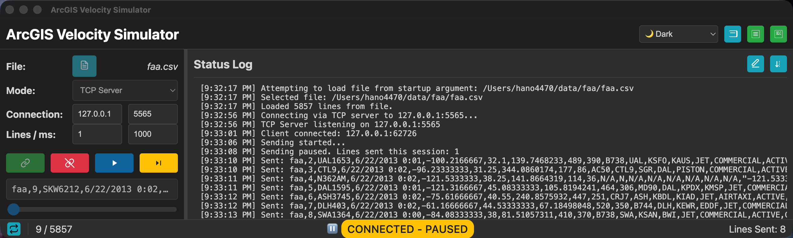

# ArcGIS Velocity Simulator


<p style="text-align: center;">
  
</p>

<p style="text-align: center;"><em>Main ArcGIS Velocity Simulator application interface.</em></p>

A cross-platform desktop application for replaying data over TCP, UDP,
HTTP/HTTPS, WebSocket, gRPC, and XMPP. Load a CSV or text file, choose a compatible
receiver, and publish records at a configurable rate. Use it with ArcGIS
Velocity feeds, ArcGIS GeoEvent Server connectors, or other endpoints that
implement the selected protocol.

## Key features

- Client and server transport roles, with explicit Direct and Registered UDP
  publishing contracts;
- CSV-first TCP/UDP conversion to Delimited, JSON, GeoJSON, or Esri JSON, and
  protocol-specific HTTP, WebSocket, gRPC, and XMPP payload choices;
- optional TCP connection greetings, IPv4/IPv6 socket settings, and TLS on
  supported transports;
- headless replay with launch configurations and completion artifacts;
- compact and full views, 15 themes, configurable fonts, and persisted UI
  preferences; and
- keyboard, gesture, and online/offline voice controls when the relevant
  feature support and permissions are enabled.

TCP and UDP are unsecure transports. UDP readiness describes the local socket,
not a remote connection or delivery guarantee. Review the transport guide
before choosing a mode or an all-interface bind.

## Quick start

### Run a release package

Release packages include Electron; Node.js and npm are not required to run
them. See [Installing and running the application](docs/installation.md) for
package selection, platform installation, first-launch security guidance,
deployed log locations, and startup troubleshooting.

### Development setup

Install dependencies and launch from a cloned checkout:

```bash
npm install
npm start
```

For runtime/toolchain prerequisites, tests, and debugging, use the
[Developer guide](docs/developer-guide.md). Packaging and signing belong to
[Build and release](docs/build-and-release.md).

### First replay

1. Select a file;
2. choose the protocol and role, then inspect **Settings** for payload format,
   endpoint details, and security options;
3. set the peer or local bind address appropriate to that role;
4. select **Connect**, then **Play** once the receiver is ready; and
5. inspect the status log and the receiver's actual records.

For a local Simulator/Logger pair, select the same named preset in both
applications. Presets fill fields without connecting or starting playback.
See [Protocol settings and presets](docs/connection-presets.md).

For a no-UI TCP replay to an existing receiver:

```bash
npm run start:headless -- filename=./data.csv protocol=tcp mode=client ip=127.0.0.1 port=5565
```

Use [Headless mode](docs/headless.md) for unattended workflows and
[Command-line reference](docs/command-line.md) for every option. A UDP Client
feed in Velocity may use registration-based receiving; select the matching
[UDP workflow](docs/udp.md#velocity-feeds), not a role inferred only from its
name.

### In-app help

- **F1** opens Help;
- **F3** opens the searchable Command Line Interface reference;
- **Cmd/Ctrl+Shift+P** opens or focuses Protocol Settings; and
- **right-click** opens the context menu.

The full shortcut reference is in [Keyboard shortcuts](docs/keyboard-shortcuts.md).
Camera and microphone support are disabled by default. Enable the desired
feature in Configuration before using its controls; see
[Configuration](docs/configuration.md) and
[Offline speech recognition](docs/offline-speech.md).

## Documentation

[`docs/README.md`](docs/README.md) is the single documentation index, including
guide purposes and audiences. The catalog below links every current guide.

| Guide | Summary |
|---|---|
| [Build and release](docs/build-and-release.md) | Prerequisites, packages, signing, and release commands. |
| [Command-line reference](docs/command-line.md) | Every option, value, default, and example. |
| [Configuration](docs/configuration.md) | App Config, Launch Config, storage, and samples. |
| [Protocol settings and presets](docs/connection-presets.md) | The connection panel and twelve paired presets. |
| [Connection summary and protocol settings](docs/connection-summary.md) | Summary rows, warnings, secret masking, and state. |
| [Data formats](docs/data-formats.md) | Input versus payload formats, CSV headers, geometry, and framing. |
| [Developer guide](docs/developer-guide.md) | Development, tests, documentation checks, debugging, and extension points. |
| [Headless mode](docs/headless.md) | No-UI replay workflows and completion artifacts. |
| [Installation](docs/installation.md) | Package selection, first launch, security warnings, and deployed logs. |
| [TCP transport](docs/tcp.md) | Roles, address families, greetings, framing, and controls. |
| [UDP transport](docs/udp.md) | Direct/Registered modes, feed compatibility, endpoints, and datagrams. |
| [gRPC transport](docs/grpc.md) | Serialization, RPC types, routing metadata, and TLS. |
| [HTTP and HTTPS transport](docs/http.md) | POST/SSE, GET polling, formats, paths, and TLS. |
| [WebSocket transport](docs/websocket.md) | Frames, subscriptions, headers, paths, and TLS. |
| [XMPP transport](docs/xmpp.md) | Direct/Room conversations, STARTTLS, accounts, and limitations. |
| [TLS and SSL security](docs/tls.md) | Certificate identities, trust, verification, and the TLS badge. |
| [ArcGIS Velocity sign-in and feed picker](docs/velocity-login.md) | Authentication, feed selection, and automatic configuration. |
| [ArcGIS Velocity REST API](docs/velocity-rest-api.md) | Management endpoint discovery and separate data endpoints. |
| [Keyboard shortcuts](docs/keyboard-shortcuts.md) | Keyboard actions and context-menu equivalents. |
| [Offline speech recognition](docs/offline-speech.md) | Local frequency-based voice controls and limitations. |

Copy and edit a [generic](docs/examples/launch-config.sample.json),
[server-mode](docs/examples/launch-config.server.sample.json),
[client-mode](docs/examples/launch-config.client.sample.json), or
[XMPP](docs/examples/launch-config.xmpp.sample.json) sample before using it.
The samples contain placeholder file paths and endpoints, not ready-to-run
connections. Configuration examples are never read automatically at runtime.

## Issues

Report bugs and feature requests through the repository's
[issue tracker](https://github.com/Esri/arcgis-velocity-simulator/issues).
Include the application version, selected transport and mode, reproduction
steps, and sanitized diagnostics; do not include credentials.

## Contributing

Esri welcomes contributions from anyone and everyone. Please see our
[contribution guidelines](https://github.com/esri/contributing) and the
[Developer guide](docs/developer-guide.md) before changing the application.

## License

Copyright 2026 Esri

Licensed under the Apache License, Version 2.0 (the "License"); you may not use
this file except in compliance with the License. You may obtain a copy of the
License at

http://www.apache.org/licenses/LICENSE-2.0

Unless required by applicable law or agreed to in writing, software distributed
under the License is distributed on an "AS IS" BASIS, WITHOUT WARRANTIES OR
CONDITIONS OF ANY KIND, either express or implied. See the License for the
specific language governing permissions and limitations under the License.

A copy of the license is available in the repository's [LICENSE](LICENSE) file.
